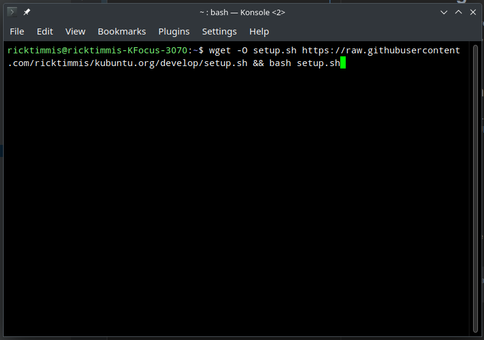

# kubuntu.org
Repository for the Kubuntu.org website. This is where we can add new pages, update old ones, maintain and manage the 
webiste and its content.


## New to development ?
No worries we have you covered, we're assuming your working on a Kubuntu, or another Ubuntu based Linux distribution.

**Step 1**

Open a terminal application such as Konsole

**Step 2**

Copy the following line and paste it into the terminal window
at the command line.

```shell
wget -O setup.sh https://raw.githubusercontent.com/ricktimmis/kubuntu.org/develop/setup.sh && bash setup.sh
```
Want more detail about what the script is doing, check the [setup documentation](./docs/setup.md)



## Start Local development of kubuntu.org

setup.sh has installed your tools, and cloned the code from Github, it's time to take a look at the website running
locally on your machine.

Do this using the terminal you opened in **Step 1** and type 

```shell
./develop.sh
```

You should see something like this


## Making changes

Open the kubuntu.org folder using the dolphin file manager, and then goto the content folder, and explore the files
open a file in Kate, make some changes and save them. Then look the local website in firefox to see those changes 
reflected there.

## Next Steps

We use the Hugo static site generator to develop kubuntu.org, so check out the
 - [Hugo Getting Started Documentation](https://gohugo.io/getting-started/)

You should also take a read of the
 - [Git and Github Getting Started documentation](https://docs.github.com/en/get-started/quickstart/hello-world)

## Further help

Reach out to our #kubuntu user or #kubuntu-devel developer channels on IRC, if you're using Kubuntu then 'Konversation' is 
where your friends are.