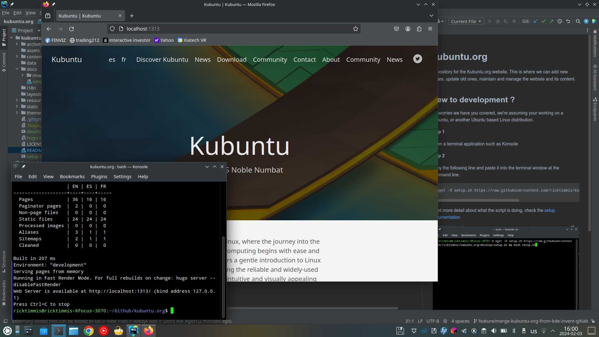

# kubuntu.org
Repository for the Kubuntu.org website. This is where we can add new pages, update old ones, maintain and manage the 
website and its content.

## Development Workflow

We follow a branching strategy to ensure stable deployments:

- `master` branch: Production environment (kubuntu.org)
- `develop` branch: Testing environment (kubuntu-team.github.io/kubuntu.org)
- Feature branches: Create from `develop` for new features or fixes

### Branch Protection Rules
- `master`: Requires pull request reviews before merging
- `develop`: Allows direct pushes for testing
- Feature branches: Create from `develop` for development work

## New to development ?
No worries we have you covered, we're assuming your working on a Kubuntu, or another Ubuntu based Linux distribution.

**Step 1**

Open a terminal application such as Konsole

**Step 2**

Copy the following line and paste it into the terminal window
at the command line.

```shell
wget -O setup.sh https://raw.githubusercontent.com/ricktimmis/kubuntu.org/develop/setup.sh && bash setup.sh
```
Want more detail about what the script is doing, check the [setup documentation](./docs/setup.md)


## Start Local development of kubuntu.org

setup.sh has installed your tools, and cloned the code from Github, it's time to take a look at the website running
locally on your machine.

Do this using the terminal you opened in **Step 1** and type 

```shell
./develop.sh
```

You should see something like this


## Making changes

1. Create a new feature branch from `develop`:
   ```shell
   git checkout develop
   git pull
   git checkout -b feature/your-feature-name
   ```

2. Make your changes:
   - Open the kubuntu.org folder using the dolphin file manager
   - Navigate to the content folder
   - Edit files in Kate
   - View changes in Firefox at http://localhost:1313

3. Commit and push your changes:
   ```shell
   git add .
   git commit -m "Description of your changes"
   git push origin feature/your-feature-name
   ```

4. Create a pull request to `develop` branch

## Deployment Process

The site is automatically deployed using GitHub Actions:

### Testing Environment
- Branch: `develop`
- URL: https://kubuntu-team.github.io/kubuntu.org
- Triggered on:
  - Push to `develop`
  - Pull requests to `develop`

### Production Environment
- Branch: `master`
- URL: https://kubuntu.org
- Triggered on:
  - Push to `master`
  - Pull requests to `master`

### Deployment Steps
1. Changes are merged to `develop` for testing
2. After testing, create a pull request to `master`
3. After review and merge, changes are automatically deployed to production

### Deployment Notifications
- Success: 🚀 Deployment successful with site URL
- Failure: ❌ Deployment failed with workflow run link
- All notifications are posted as commit comments

## Build and Optimization

The build process includes:
- Hugo static site generation
- Image optimization
- CSS and JavaScript minification
- Sitemap generation
- Broken link checking

## Next Steps

We use the Hugo static site generator to develop kubuntu.org, so check out the
 - [Hugo Getting Started Documentation](https://gohugo.io/getting-started/)

You should also take a read of the
 - [Git and Github Getting Started documentation](https://docs.github.com/en/get-started/quickstart/hello-world)

## Further help

Reach out to our #kubuntu user or #kubuntu-devel developer channels on IRC, if you're using Kubuntu then 'Konversation' is 
where your friends are.